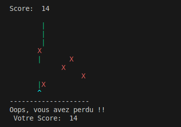

# Retro Shooter - Jeu de Tir en ASCII

## Description

**Retro Shooter** est un jeu de tir simple en ASCII, où vous incarnez un vaisseau spatial qui doit esquiver et tirer sur des ennemis. Le jeu est écrit en Ada et se déroule dans un terminal. Il s'inspire des jeux classiques de type shoot 'em up, mais avec une esthétique rétro en ASCII.

## Fonctionnement du jeu

Le but du jeu est de détruire autant d'ennemis que possible tout en évitant qu'ils ne vous touchent. Le vaisseau est situé en bas de l'écran et vous devez utiliser les touches pour le déplacer et tirer des projectiles vers les ennemis qui descendent du haut de l'écran. Le jeu se termine si un ennemi vous touche.

### Mécaniques du jeu
- **Le Vaisseau** : Vous contrôlez un vaisseau en bas de l'écran, représenté par le caractère `^`. Vous pouvez le déplacer de gauche à droite.
- **Les Ennemis** : Les ennemis sont représentés par le caractère `X`. Ils descendent lentement du haut de l'écran et vous devez les éviter ou les détruire.
- **Les Projectiles** : Vous pouvez tirer des projectiles (représentés par le caractère `|`) pour détruire les ennemis. Les projectiles se déplacent vers le haut.
- **Score** : À chaque fois que vous touchez un ennemi, vous gagnez des points.
- **Game Over** : Si un ennemi touche votre vaisseau, le jeu se termine et un message "Oops, vous avez perdu !" est affiché.

## Comment jouer

1. **Déplacement** : Utilisez les touches `A` pour déplacer votre vaisseau vers la gauche et `D` pour le déplacer vers la droite.
2. **Tirer** : Appuyez sur la touche `Espace` pour tirer un projectile.
3. **Quitter** : Appuyez sur la touche `Q` pour quitter le jeu à tout moment.
4. **Perdre** : Le jeu se termine automatiquement si un ennemi touche votre vaisseau. Un message de fin "Oops, vous avez perdu !" s'affiche.

## Instructions

1. Clonez ce repository ou téléchargez les fichiers sources.
2. Compilez le code Ada avec alire.
3. Exécutez le programme pour commencer à jouer.

```bash
cd retro_shooter
alr build
alr run
```
## Image de fin du jeu


